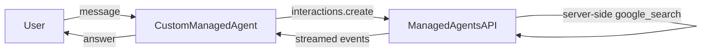

# Managed Agent: Create and Use a Custom Agent

> For setup, authentication, backends, and background on `ManagedAgent`, see the
> [ManagedAgent guide](../../../../docs/guides/agents/managed_agent/index.md).

## Overview

This sample demonstrates the **control-plane lifecycle** of a custom managed
agent: creating a persistent, named agent *resource* — its persona and
server-side tools baked in — then driving it and deleting it.

You do **not** need a custom resource just to set a persona or server-side
tools. `ManagedAgent` accepts both inline: `instruction=...` for a persona (see
the [`system_instruction`](../system_instruction) sample) and
`tools=[google_search]` for server-side tools (see the [`basic`](../basic)
sample). Create a custom resource when you instead want a reusable,
server-managed agent that other apps and sessions can share by id.

This module drives that lifecycle: run it with `--create` to provision the
resource (reusing the genai client `ManagedAgent` already holds,
`root_agent.api_client`, which exposes both interactions and agent
create/delete), then drive `root_agent` with `adk web` / `adk run`, and
`--delete` to remove it.

## Setup

Custom-agent creation requires the **GEAP / Vertex** backend (`global`
location); the Gemini API backend cannot create agent resources. For backend
selection, authentication, and credentials, see the
[ManagedAgent guide](../../../../docs/guides/agents/managed_agent/index.md#prerequisites).

## Usage

```bash
# 1. Create the custom agent (once).
python contributing/samples/managed_agent/custom_agent/agent.py --create

# 2. Chat with it. Provisioning can take a few minutes (longer for the first
#    agent in a project), so wait a moment after --create before the first turn.
adk run contributing/samples/managed_agent/custom_agent
#    or: adk web

# 3. Delete it when done.
python contributing/samples/managed_agent/custom_agent/agent.py --delete
```

Creation is asynchronous: `--create` returns before the agent is fully ready, so
if the first turn fails with a "not found" / "being created" error, wait a few
seconds and retry.

## Sample Inputs

Answers are grounded in live search, so exact text varies:

- `What are the most significant AI announcements this week?`

  The created agent's persona makes it answer **concisely** and **cite its
  sources**, using server-side `google_search`.

- `Summarize that in one sentence.`

  A follow-up turn that reuses the recovered interaction (multi-turn chaining).

## Graph



## How To

- **Define the custom agent**: pass a `system_instruction` (persona) and
  server-side `tools` (here `{'type': 'google_search'}`) to
  `client.agents.create(...)`, extending the `antigravity-preview-05-2026` base
  agent.
- **Reuse the ManagedAgent client**: `root_agent.api_client` is the genai client
  `ManagedAgent` already holds; its `agents.create` / `agents.delete` cover the
  control plane.
- **Provision a sandbox**: `ManagedAgent(environment={'type': 'remote'})` gives
  each interaction a remote sandbox (required to run the agent).
- **Run it**: `--create` provisions, `--delete` removes; in between, `root_agent`
  is a normal `BaseAgent`, so `adk web` / `adk run` (or a `Runner`) drive it.
